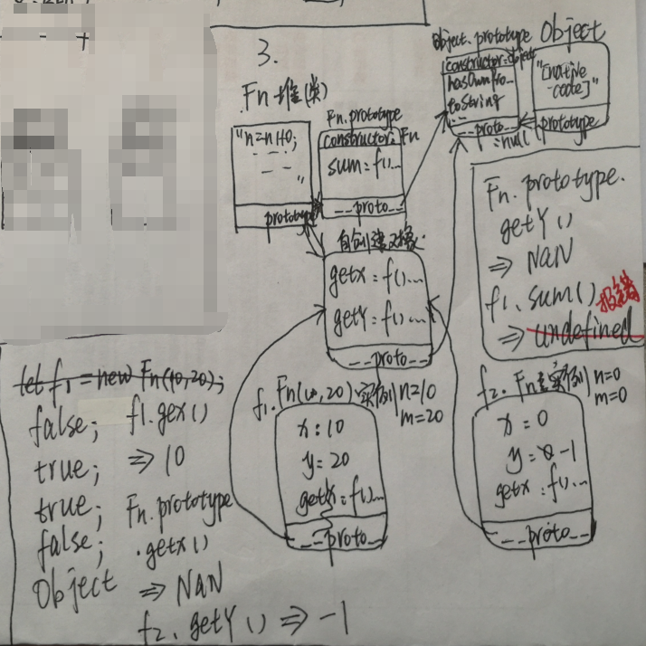

## 20200325作业（w2j1）
> 第二周正式课–课后作业（1）

1.实现函数fn，让其具有如下功能（百度二面）
```
let res = fn(1,2)(3);
console.log(res); //=>6  1+2+3
```
答：
```
function fn(x, y) {
    x += y;
    return function (n) {
        return x + n;
    }
}
let res = fn(1, 2)(3);
console.log(res); //=>6  1+2+3
```

2.写出下面代码输出的结果 （画图）
```
var x=2;
var y={
    x:3,
    z:(function(x){
        this.x*=x;
        x+=2;
        return function(n){
            this.x*=n;
            x+=3;
            console.log(x);
        }
    })(x)
};
var m=y.z;
m(4);
y.z(5);
console.log(x, y.x);
```
答：7 10 16,15


3.写出下面代码的输出结果（画图）
```
function Fn(n,m) {
    n=n||0;
    m=m||0;
    this.x = n;
    this.y = m;
    this.getX = function () {
        console.log(this.x);
    }
    return n+m;
}
Fn.prototype.sum=function(){
    console.log(this.x+this.y);
}
Fn.prototype={
    getX:function(){
        this.x+=1;
        console.log(this.x);
    },
    getY:function(){
        this.y-=1;
        console.log(this.y);
    }
};
let f1 = new Fn(10,20);
let f2 = new Fn;
console.log(f1.getX === f2.getX);
console.log(f1.getY === f2.getY);
console.log(f1.__proto__.getY === Fn.prototype.getY);
console.log(Fn.prototype.getX === f2.getX);
console.log(f1.constructor);
f1.getX();
Fn.prototype.getX();
f2.getY();
Fn.prototype.getY();
f1.sum();
```
答：false true true false Object 10 NaN -1 NaN 报错



4.写出下面代码输出的结果（画图 腾讯面试题）
```
function fun(){
    this.a=0;
    this.b=function(){
        alert(this.a);
    }
}
fun.prototype={
    b:function(){
        this.a=20;
        alert(this.a);
    },
    c:function(){
        this.a=30;
        alert(this.a)
    }
}
var my_fun=new fun();
my_fun.b();
my_fun.c();
```
答：0（弹窗） 30（弹窗）


5.写出下面代码输出的结果 （百度面试题）
```
function C1(name) {
    if (name) {
        this.name = name;
    }
}
function C2(name) {
    this.name = name;
}
function C3(name) {
    this.name = name || 'join';
}
C1.prototype.name = 'Tom';
C2.prototype.name = 'Tom';
C3.prototype.name = 'Tom';
alert((new C1().name) + (new C2().name) + (new C3().name));
```
答：Tomundefinedjoin

6.写出下面代码输出的结果 （画图）
```
function Fn() {
    let a = 1;
    this.a = a;
}
Fn.prototype.say = function () {
    this.a = 2;
}
Fn.prototype = new Fn;
let f1 = new Fn;
​
Fn.prototype.b = function () {
    this.a = 3;
};
console.log(f1.a);
console.log(f1.prototype);
console.log(f1.b);
console.log(f1.hasOwnProperty('b'));
console.log('b' in f1);
console.log(f1.constructor == Fn);
```
答：1 undefined f(){} false true true


7.写出下面代码输出的结果 （画图）
```
function Person() {
    this.name = 'zhufeng'
};
Person.prototype.getName = function () {
    console.log(this.name)
    console.log(this.age)
};
Person.prototype.age = 5000;

var per1 = new Person;
per1.getName();
per1.age = 9;
per1.getName();
console.log(per1.age);
var per2 = new Person;
console.log(per2.age);
```
答：‘zhufeng’ 5000 ‘zhufeng’ 9 9 5000


8.编写程序实现如下效果 （百度面试题）
```
let n = 10;
let m = n.plus(10).minus(5);
console.log(m);//=>15（10+10-5）
```
答：
```
Number.prototype.plus = function plus(x) {
    return x + this;
}

Number.prototype.minus = function minus(y) {
    return this - y;
}

let n = 10;
let m = n.plus(10).minus(5);
console.log(m); //=>15（10+10-5）
```

9.编写程序实现如下效果 （经典面试题）
```
let ary = [12,23,12,13,13,12,23,14,8];
ary.unique().sort((a,b)=>a-b);
//=> 最后的ary等于[8,12,13,14,23]
```
答：
```
<script>
Array.prototype.unique = function unique() {
// 给相应类的原型添加属性
    let obj = {};
    for (let i = 0; i < this.length; i++) {
        let index = this[i];
        if (typeof (obj[index]) !== 'undefined') {
            // 检测obj中的属性值是否存在，不存在就是undefined
            this[i] = this[this.length - 1];
            // 让最后一项覆盖重复的这一项
            this.length--;
            // 然后去掉最后一项
            i--;
            continue;
        }
        obj[index] = index;
    }
    obj = null;
    return this;
}
let ary = [12, 23, 12, 13, 13, 12, 23, 14, 8];
ary.unique().sort((a, b) => a - b);
console.log(ary);
//=> 最后的ary等于[8,12,13,14,23]
```

10.一个url后面好多key:value，如localhost?key=val&key2=val2&key3=val3，封装一个函数 getParam(‘key’) 通过key获得相应等号后面的值（百度面试题）
```
let url="locallhost?key1=val1&key2=val2&key3=val3";
console.log(url.getParam("key3")); 
//=>'val3'
```
答：
```
String.prototype.getParam = function getParam() {
    let askIndex = indexOf('?'),
        askText = '';
    askText = substring(askIndex + 1);

    obj = String.prototype.obj;
    if (askText) {
        askText.split('&').forEach(function (item) {
            item = item.split('=');
            this.obj[item[0]] = item[1];
        });
    }
    return obj;

}

let url = "locallhost?key1=val1&key2=val2&key3=val3";
// console.log(getParam(url));
console.log(url.getParam("key3"));
```

附加作业（有难度，全部都是大公司原版面试题，不会做的可以空着）
情人节福利题：重构内置new方法

function Dog(name) {
    this.name = name;
}
Dog.prototype.bark = function () {
    console.log('wangwang');
}
Dog.prototype.sayName = function () {
    console.log('my name is ' + this.name);
}
/*
let sanmao = new Dog('三毛');
sanmao.sayName();
sanmao.bark();
*/
//=>基于内置的new关键词，我们可以创建Dog的一个实例sanmao，实例可以调取原型上的属性和方法，现在的需求是：自己实现一个_new方法，也能模拟出内置new后的结果
function _new() {
    //=>完成你的代码

}
let sanmao = _new(Dog, '三毛');
sanmao.bark(); //=>"wangwang"
sanmao.sayName(); //=>"my name is 三毛"
console.log(sanmao instanceof Dog); //=>true
下面代码a在什么值情况下会输出1

var a = ?;
if (a == 1 && a == 2 && a == 3) {
    console.log(1);
}
下面代码的输出结果？为什么？

let obj = {
    2: 3,
    3: 4,
    length: 2,
    push: Array.prototype.push
}
obj.push(1);
obj.push(2);
console.log(obj);
阿里超经典面试题

function Foo() {
    getName = function () {
        console.log(1);
    };
    return this;
}
Foo.getName = function () {
    console.log(2);
};
Foo.prototype.getName = function () {
    console.log(3);
};
var getName = function () {
    console.log(4);
};
function getName() {
    console.log(5);
}
Foo.getName();
getName();
Foo().getName();
getName();
new Foo.getName();
new Foo().getName();
new new Foo().getName();